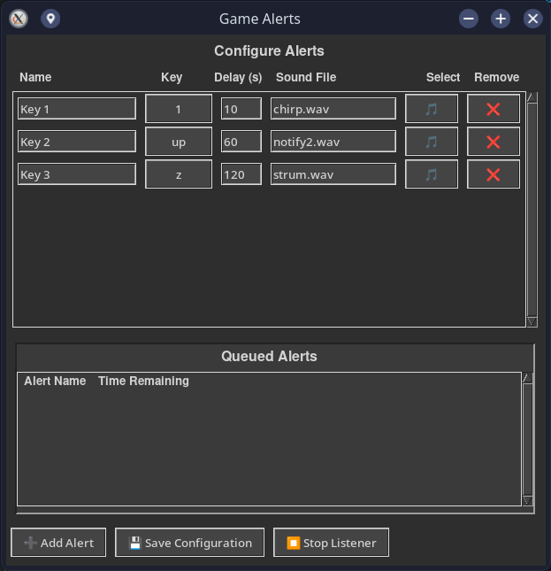

# InputAlerts

A Python-based real-time event monitoring and alert system for configurable input triggers, designed to demonstrate alerting logic, event handling, and real-time notifications. While demonstrated with user input events, the architecture is applicable to real-time monitoring scenarios relevant to SOC/NOC dashboards and IT operations.

## Screenshot



## Features

- Real-time monitoring of keyboard and mouse input
- Configurable triggers (keys or mouse buttons) with delay timers
- Custom alert notifications (sound)
- Live queue display for active alerts
- Threaded, event-driven architecture for real-time performance

## Requirements

- Python 3.x
- `tkinter` (usually included with Python)
- `evdev` (`pip install evdev`)
- Linux OS with access to `/dev/input/event*` devices
- `aplay` for playing `.wav` files

## Usage

1. Run the app:
```bash
python3 InputAlerts.py
```
2. Configure alerts:
   - Name
   - Key or mouse trigger
   - Delay (seconds)
   - Sound file
3. Start the listener using the GUI button
4. Alerts will trigger based on the configured input events

## Optional: Sample Configuration

A template `alerts_config_template.json` can be provided so users can see the expected format without sharing personal config.

```json
[
  {
    "name": "Sample Alert",
    "key": "a",
    "delay": 10,
    "sound": "path/to/sample.wav"
  }
]
```

## Notes

- The listener only starts if a valid configuration exists
- The architecture can be adapted to monitor other real-time events, logs, or system notifications
